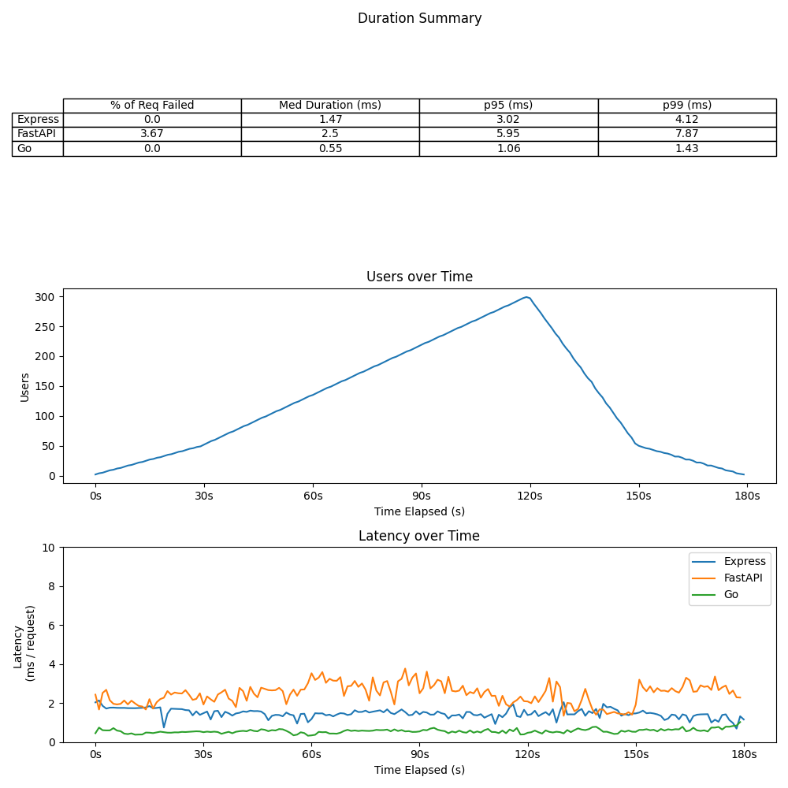

# api_load_test_project
Load testing APIs written in different languages

## Installing and running test locally

#### FastAPI server
1. Activate a local environment and install the requirements from the 'requirements.txt' file with `python3 -m pip install -r requirements.txt`
2. Call `uvicorn main:app` from the CLI. Note: Must be within the 'app' folder
3. FastAPI server running on port 8000

#### Node.js (Express) server
1. Install the required packages by running `npm install` from the CLI. Note you must be in the 'express_app' folder.
2. Run `npm start` from the command line to start the nodemon server. 
3. Express server running on port 3000

#### Go server
1. Install the required modules with `go install`. Must run from the 'web-service-gin' folder. 
2. Start server with `go run .` from the root of the 'web-service-gin' folder. 
3. Go server running on port 8080

Each server has a GET '/' endpoint that returns a simple JSON. Some servers have different endpoints, but the load testing was all conducted against the GET '/' endpoint, for reasons explained in the 'Latency Comparison' section. 

#### Running the load tests
Loading testing is done using the [k6](https://k6.io/docs/) library. There are three commands available that can be run from within the 'express-app' directory:
- `npm run load-test`
- `npm run stress-test`
- `npm run spike-test`

Each accepts environment arguments that specify which port and which app you are running. For example, calling `PORT=3000 APP=express npm run load-test` will run the load-test against the express app and will output time_series data to the 'timeseries_etl/csv' file

Charts and tables were generated with a Jupyter notebook. Assuming the virtual environment was set up and dependencies were installed, run `jupyter notebook` in the commnad line from the 'timeseries_etl' folder. The notebook 'timeseries_data_clean' contains the code for loading / transforming the data. Note when running the notebook - the notebook assumes that a csv file exists for each testing permutation (app + test type) - so 9 total. Running the load tests command will generate the necessary CSVs. 

## Express vs FastAPI vs Go latency comparison

The following graphs illustrate the latency and failure rate between APIs built with FastAPI and Express. For each test, the API calls a single endpoint that returns a simple JSON response. Originally, each API was querying a SQLite DB. These tests proved unfair, since the addition of a database connection library added differing amounts of additional latency time for FastAPI and Express. Specifically, the 'sql-alchemy' python package added significantly more latency than the 'sequelize' node package. In order to best compare the API frameworks in isolation, this additional variable was removed.

### Load Test
The load test had the following stages:
 - 1m scaling up to 100 users
 - 1m remaining at 100 users
 - 30s scaling down to 50 users
 - 30s scaling down to 0 users

Generally, the decisions on how many users to set on a load test is derived from real world / deployed app data. Since this is an experiment that has no real world user data to set as a reference, I used 100 since it is a nice round number, and at that number both APIs successfully handle each request. 

### Stress Test
The stress test has the following stages:
 - 30s scale up to 50 users
 - 1m30s scale up to 300 users
 - 30s scale down to 50 users
 - 30s scale down to 0 users

 The stress test should simulate a scenario where an API or web app is under higher than usual load for a sustained period of time. Since 100 users is our imaginary benchmark for a 'typical' situation, I selected 300 as a "stress", and kept the system stressed for 1m 30s. Under these conditions, FastAPI began to fail request, starting at around 250 users. About 4% of its request failed, where none failed for Express or Go.

### Spike Test
The spike test has the following stages:
 - 1m scale up to 50 users
 - 15s scale up to 1000 (!!!) users
 - 15s scale down to 50 users
 - 1m constant at 50 users
 - 30s scale down to 0 users

 The spike test should simulate a scenario where the API or web app experiences a sharp - but not sustained - increase in traffic / activity. Under these conditions, 43% of request made to the FastAPI endpoint failed, while no requests made to Express or Go failed.

### Conclusion
Based on the data, Go appears to be a superior language for writing an API if you want to optimze for speed. Go was 1-2 ms faster than Express in key metrics and, like Express, did not drop any requests. If a product owner can accept a 1-2 ms slower response time, Express may be a superior choice simply because more developers are familiar with JavaScript. 