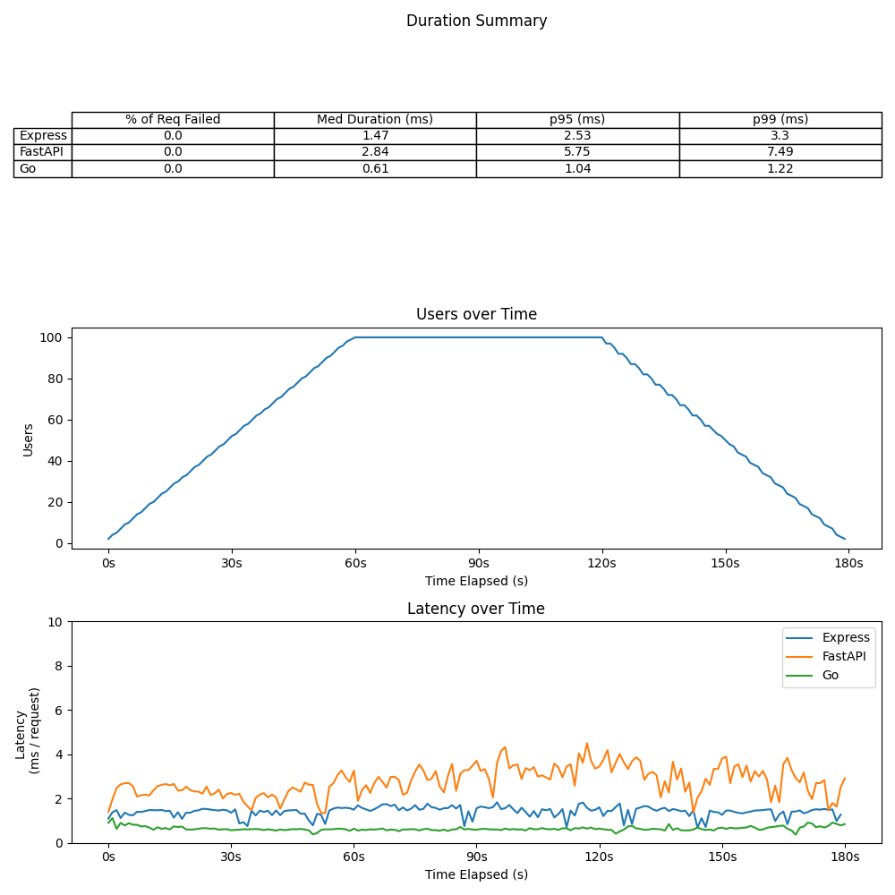

# api_load_test_project
Load testing APIs written in different languages

## Express vs FastAPI latency comparison

The following graphs illustrate the latency and failure rate between APIs built with FastAPI and Express. For each test, the API calls a single endpoint that returns a simple JSON response. Originally, each API was querying a SQLite DB. These tests proved unfair, since the addition of a database connection library added differing amounts of additional latency time for FastAPI and Express. Specifically, the 'sql-alchemy' python package added significantly more latency than the 'sequelize' node package. In order to best compare the two API frameworks in isolation, this additional variable was removed.

### Load Test
The load test had the following stages:
 - 1m scaling up to 100 users
 - 1m remaining at 100 users
 - 30s scaling down to 50 users
 - 30s scaling down to 0 users

Generally, the decisions on how many users to set on a load test is derived from real world / deployed app data. Since this is an experiment that has no real world user data to set as a reference, I used 100 since it is a nice round number, and at that number both APIs successfully handle each request. 

### Stress Test
The stress test has the following stages:
 - 30s scale up to 50 users
 - 1m30s scale up to 300 users
 - 30s scale down to 50 users
 - 30s scale down to 0 users

 The stress test should simulate a scenario where an API or web app is under higher than usual load for a sustained period of time. Since 100 users is our imaginary benchmark for a 'typical' situation, I selected 300 as a "stress", and kept the system stressed for 1m 30s. Under these conditions, FastAPI began to fail request, starting at around 250 users. About 4% of its request failed, where none failed for Express

### Spike Test
The spike test has the following stages:
 - 1m scale up to 50 users
 - 15s scale up to 1000 (!!!) users
 - 15s scale down to 50 users
 - 1m constant at 50 users
 - 30s scale down to 0 users

 The spike test should simulate a scenario where the API or web app experiences a sharp - but not sustained - increase in traffic / activity. Under these conditions, 43% of request made to the FastAPI endpoint failed, while no requests made to express failed.

